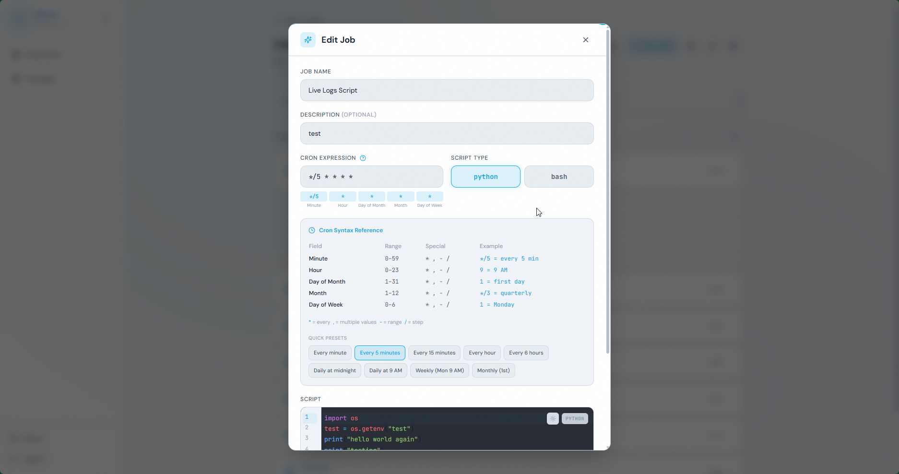
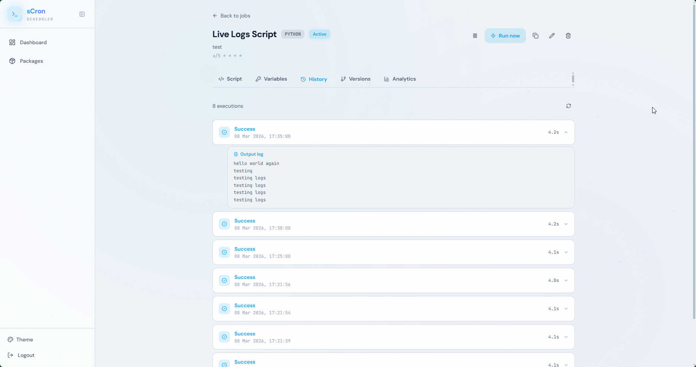
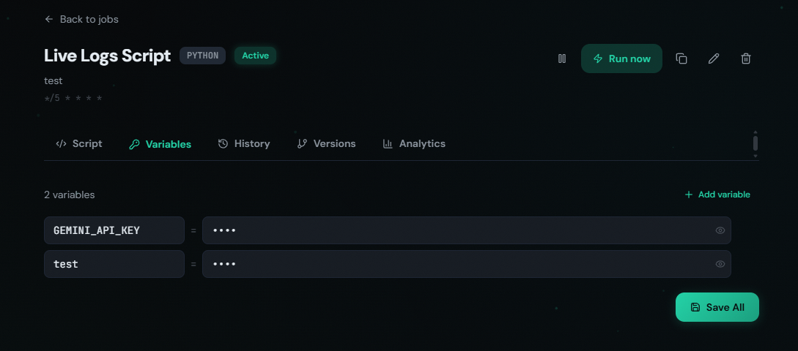
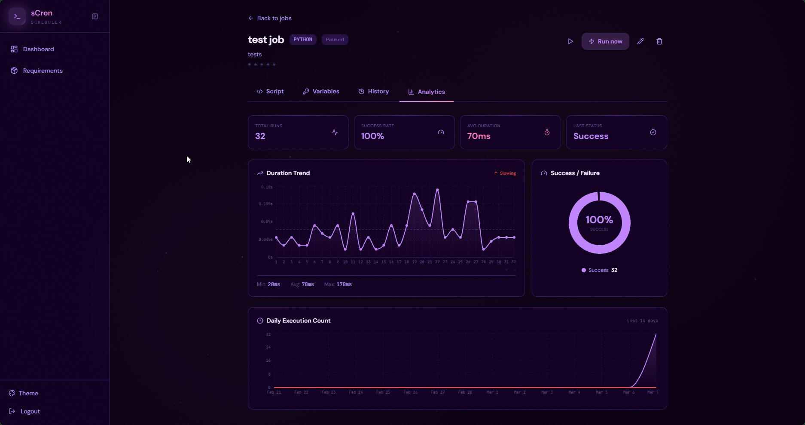
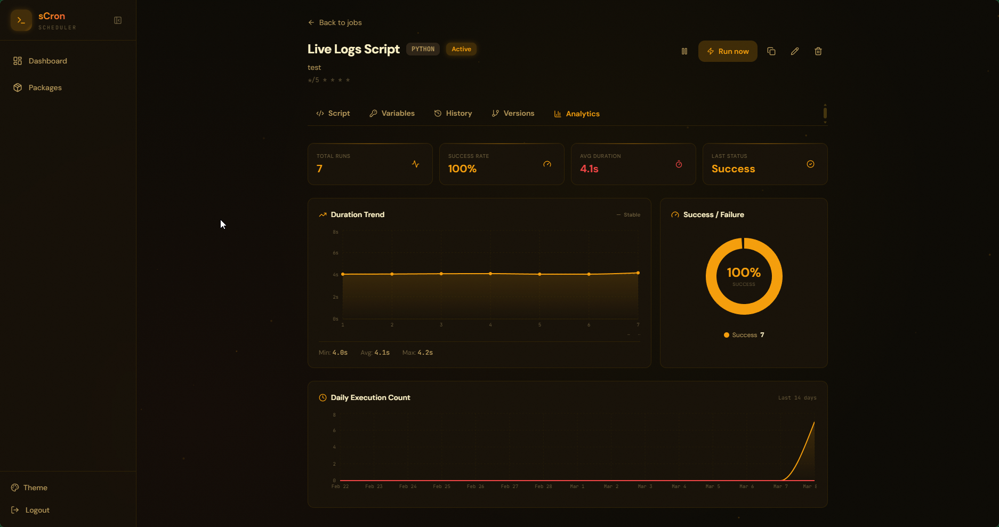
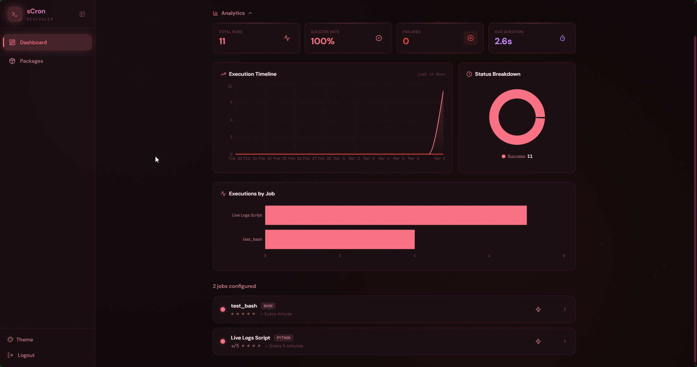

# sCron UI

The web dashboard for sCron — a self-hosted cron job management platform. Provides a visual interface for creating, monitoring, and organising scheduled jobs with real-time log streaming, analytics charts, and a code editor.

## Problem Statement

Even with a well-built backend API, managing cron jobs through curl or Postman is impractical for daily use. Operators need a dashboard where they can see at a glance which jobs are running, which failed overnight, edit a script without SSH-ing into a server, and watch logs stream in real-time. sCron UI provides exactly this — a focused, single-purpose interface that makes cron job management feel like a product instead of a chore.

## Features

### Dashboard

- **Overview cards** — total jobs, active/paused count, execution success rate, average duration
- **Execution timeline chart** — daily success/failure/running counts for the last N days (Recharts area chart)
- **Per-job success breakdown** — stacked bar chart showing each job's execution distribution
- **Hourly heatmap** — hour-of-day × day-of-week grid showing when jobs run most frequently

### Job Management


- **Job list** with status badges (active/paused), cron expression in human-readable form (via `cronstrue`), tags, and quick-action buttons
- **Create/Edit form** with fields for name, description, script type (Python/Bash), cron expression, timeout, dependencies, and tags
- **Dependency selector** — pick upstream jobs from a dropdown; shows dependency chain visually
- **Tag filtering** — click a tag to filter the job list; tag management from a dedicated section
- **Job duplication** — one-click clone with all settings, env vars, and tags

### Code Editor


- **CodeMirror 6** with Python and Bash syntax highlighting
- **Script version history** — browse all past versions with timestamps and change summaries
- **Version restore** — revert to any previous version with one click

### Live Log Streaming
- **WebSocket-based** real-time log viewer — connects to the backend's broadcast channel
- **Auto-scroll** with manual scroll lock when the user scrolls up
- **Buffered catch-up** — late joiners receive recent history before the live stream

### Execution History

- **Paginated table** of all past executions with status, duration, exit code, and timestamps
- **Expandable log output** — click an execution to see its captured stdout/stderr
- **Replay button** — re-run a past execution using the exact script version from that run
- **Cancel button** — stop a running execution (sends SIGTERM to the subprocess)

## Dependency Management
- **Requirements File** — Easily write the package name required for your script within the UI. 


### Environment Variables

- **Encrypted at rest** — values are Fernet-encrypted in the backend; the UI never sees raw ciphertext
- **Inline editor** — add, edit, and delete key-value pairs with a clean table UI
- **Bulk import** — replace all env vars at once

### Analytics (Per-Job)


- **Stats card** — total executions, success rate, avg/min/max duration, last run status
- **Duration trend chart** — line chart of execution duration over the last N runs
- **Daily timeline** — per-job version of the global execution timeline

### Notifications Settings

- **Telegram** — enter chat ID, toggle on/off
- **Email** — uses the email from user profile, toggle on/off
- **Trigger selector** — "On failure only" (default), "Always", or "Never"

### User Profile
- **Display name** and **email** management
- Email is required before enabling email notifications

### Job Templates
- **Pre-built templates** — Health Check (HTTP), Database Backup (pg_dump), Disk Space Alert, Slack Webhook, File Cleanup, Python Starter
- **One-click create** — select a template, customise, and save as a new job

### Authentication
- **JWT-based** — access token (30 min) + refresh token (30 days) with automatic rotation
- **Graceful session expiry** — dispatches a `scron:session-expired` custom event instead of hard-navigating to `/login`, preserving unsaved state
- **Login and Signup** pages with optional email during registration

### UX
- **Dark/Light/System theme** with smooth transitions (Tailwind CSS)
- **Responsive layout** — sidebar navigation, mobile-friendly
- **Toast notifications** via `react-hot-toast`
- **Animated transitions** via Framer Motion
- **Particle canvas** background on auth pages




## Tech Stack

| Layer | Technology |
|---|---|
| Framework | React 18 |
| Build tool | Vite 6 |
| Routing | React Router v6 |
| Styling | Tailwind CSS 3 |
| Charts | Recharts |
| Code editor | CodeMirror 6 (`@uiw/react-codemirror`) |
| Icons | Lucide React |
| Animations | Framer Motion |
| Notifications | react-hot-toast |
| Cron display | cronstrue (human-readable cron) |
| Deployment | Vercel / static hosting |

## Project Structure

```
scron-ui/
├── index.html                       # Entry point (Vite injects the React bundle)
├── vite.config.js                   # Vite config: React plugin, dev proxy to :8000
├── tailwind.config.js               # Theme customisation, dark mode class strategy
├── postcss.config.js                # PostCSS with Tailwind + Autoprefixer
├── vercel.json                      # Vercel SPA routing config
├── public/
│   ├── manifest.json                # PWA manifest
│   ├── favicon.svg                  # App icon
│   └── *.png                        # Apple touch icon, PWA icons
├── src/
│   ├── main.jsx                     # React DOM entry point
│   ├── App.jsx                      # Router, providers, route definitions
│   ├── index.css                    # Tailwind base/components/utilities + custom styles
│   ├── lib/
│   │   └── api.js                   # API client: token management, auto-refresh,
│   │                                #   convenience wrappers (auth, jobs, tags,
│   │                                #   notifications, templates, analytics, profile)
│   ├── context/
│   │   ├── AuthContext.jsx          # Auth state + session-expired event listener
│   │   └── ThemeContext.jsx         # Dark/light/system theme state
│   ├── components/
│   │   ├── Layout.jsx               # Sidebar nav, header, main content area
│   │   ├── ProtectedRoute.jsx       # Redirect to /login if not authenticated
│   │   ├── CodeEditor.jsx           # CodeMirror wrapper (Python/Bash modes)
│   │   ├── DashboardCharts.jsx      # Recharts: timeline, heatmap, breakdown
│   │   ├── EnvVarsEditor.jsx        # Key-value table editor for env vars
│   │   ├── ExecutionHistory.jsx     # Paginated execution table + log viewer
│   │   ├── JobAnalytics.jsx         # Per-job stats + duration trend chart
│   │   ├── JobForm.jsx              # Create/edit job form (deps, tags, timeout)
│   │   ├── LiveLog.jsx              # WebSocket log streamer with auto-scroll
│   │   ├── NextRuns.jsx             # Upcoming scheduled run times
│   │   ├── ParticleCanvas.jsx       # Animated particle background (auth pages)
│   │   ├── ThemeSwitcher.jsx        # Dark/light/system toggle
│   │   └── VersionHistory.jsx       # Script version list + restore button
│   └── pages/
│       ├── Dashboard.jsx            # Main dashboard: overview cards + charts + job list
│       ├── JobDetail.jsx            # Single job: editor, env vars, executions, analytics
│       ├── Login.jsx                # Login form
│       ├── Signup.jsx               # Signup form (with optional email)
│       └── Requirements.jsx         # Shared requirements.txt editor + pip output
```

## Getting Started

### Prerequisites
- Node.js 18+
- npm or yarn

### Development

```bash
# Install dependencies
npm install

# Start dev server (proxies /api to localhost:8000)
npm run dev
# → http://localhost:3000

# The backend must be running on port 8000 for API calls to work.
# See the backend README for setup instructions.
```

### Build for Production

```bash
npm run build
# Output: dist/

# Preview the production build locally
npm run preview
```

### Deploy

The app is a static SPA. Deploy the `dist/` folder to any static host:

- **Vercel** — `vercel.json` is included for SPA routing
- **Nginx** — serve `dist/`, add `try_files $uri /index.html` for client-side routing
- **S3 + CloudFront** — upload `dist/`, configure error page to `index.html`

The API base URL defaults to `/api` (same origin). For cross-origin deployments, set the `VITE_API_BASE` environment variable at build time.

## API Client (`src/lib/api.js`)

The API client handles authentication transparently:

- Injects `Authorization: Bearer <token>` on every request
- On 401, automatically refreshes the access token and retries once
- On double-401 (refresh also failed), dispatches `scron:session-expired` custom event
- Token storage: in-memory (primary) + localStorage (survives page reloads)

Available modules:

| Module | Methods |
|---|---|
| `auth` | `login`, `signup`, `logout` |
| `profile` | `get`, `update` |
| `jobs` | `list`, `get`, `create`, `update`, `delete`, `trigger`, `cancel`, `replay`, `duplicate`, `getEnv`, `setEnv`, `setEnvBulk`, `deleteEnv`, `getExecutions`, `getVersions`, `getVersion`, `restoreVersion`, `getNextRuns`, `getStreamStatus`, `getRequirements`, `updateRequirements` |
| `tags` | `list`, `create`, `update`, `delete` |
| `notifications` | `get`, `update` |
| `templates` | `list` |
| `analytics` | `getOverview`, `getTimeline`, `getHeatmap`, `getJobBreakdown`, `getJobStats`, `getJobDuration`, `getJobTimeline` |

## License

AGPL-3.0
